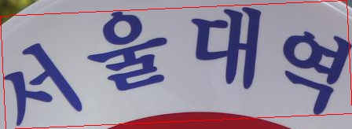
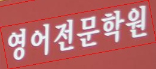
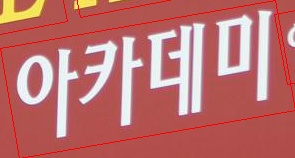
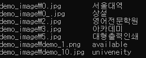
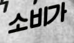

# Korean OCR with clova ai's deep-text-recognition-benchmark

#### korean prediction results

| demo images | [TPS-ResNet-BiLSTM-Attn korean](https://drive.google.com/open?id=1oPnk1NWcyTwKC-IAC9pbk_cctzvwgt0r) | 
| ---         |        --- |
|       |    서울대역    |  
|       |    상설    |  
|       |    영어전문학원    |   
|       |    아카데미    | 
|       |    대형출력인쇄    | 
|     |   available   |  

We have added Hangul to the project and modified it for reading. trainings studied 500000 sets of Korean and English datasets made using synth text, and the examples of those datasets are as follows.

model downlaod : [TPS-ResNet-BiLSTM-Attn-korean.pth](https://drive.google.com/open?id=1oPnk1NWcyTwKC-IAC9pbk_cctzvwgt0r)

| Trainning images | GT text | 
| ---         |        --- |
|       |    항자원    |  
|       |    신청을    |  
|       |    Polizei!    |  
|       |    때문에    |  
|       |    소비가    |  

update soon
