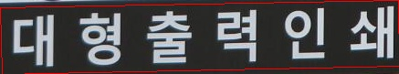

# Korean OCR with clova ai's deep-text-recognition-benchmark

#### korean prediction results

| demo images | [TPS-ResNet-BiLSTM-Attn korean](https://drive.google.com/file/d/1AOucYNbIvzclpurXVAFiBi7imrNMFjVJ/view?usp=sharing) | 
| ---         |        --- |
|       |    서울대역    |  
|       |    상설    |  
|       |    영어전문학원    |   
|       |    아카데미    | 
|       |    대형출력인쇄    | 
|     |   available   |  

We have added Korean to the project and modified it for reading. trainings studied 500000 sets of [Korean](http://ptak.felk.cvut.cz/public_datasets/SyntText/Korean.zip) and English datasets made using synth text, and the examples of those datasets are as follows.

| Trainning images | GT text | 
| ---         |        --- |
|       |    항자원    |  
|       |    신청을    |  
|       |    Polizei!    |  
|       |    때문에    |  
|       |    소비가    |  

After securing the Korean data set, input is required to the Korean string. 
We modified train.py and saved Korean consonants in the file [KoreanCodec.txt](https://github.com/GreenGarnets/KoreanOCR-with-deep-text-recognition-benchmark/blob/master/koreanCodec.txt) so that we could call it up. 

model downlaod : [TPS-ResNet-BiLSTM-Attn-korean.pth](https://drive.google.com/file/d/1AOucYNbIvzclpurXVAFiBi7imrNMFjVJ/view?usp=sharing)
Please contact me if there is a problem with the model.

If the OCR image is corrected for tilting and further learning, 99.922% of the accuracy of the Korean OCR was shown, but the model cannot be disclosed due to the research project contract. 

|  
Predict
 |  
GT
 |  
Result
 |
|:--------:|:--------:|:--------:|
|
배산공원 
 | 
배산공원 
 |True |
|
87 
 | 
87 
 |True |
|
300m 
| 
300m 
 |True |
|
분당소방서 
| 
분당소방서 
 |True |
|
시의회 
| 
시의회 
 |True |

[100000/100000] **Train Loss: 0.00663** elapsed_time: 2609.21140 
[100000/100000] **valid loss: 0.00391** **accuracy: 99.922**, norm_ED: 0.83

